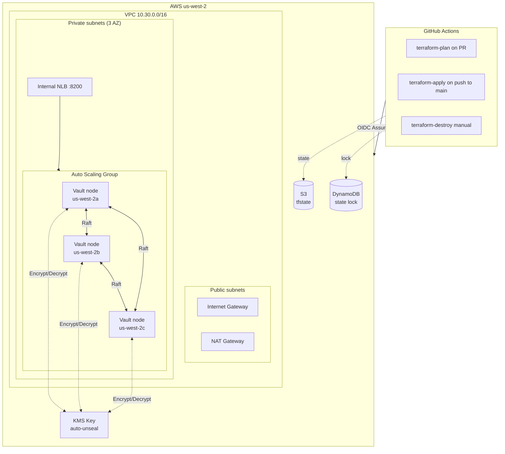
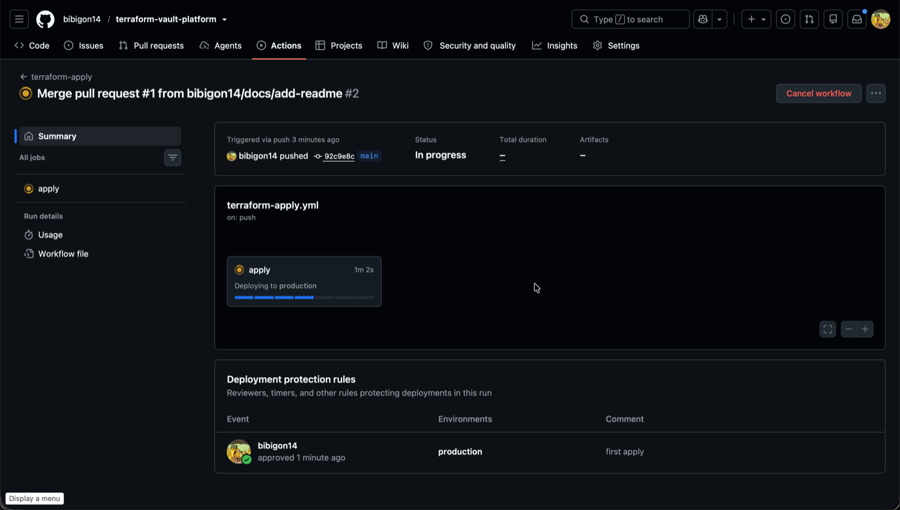
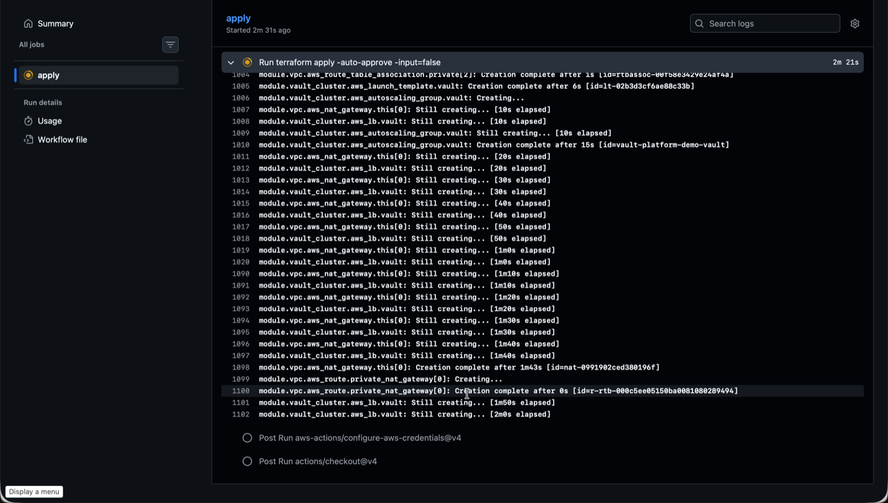
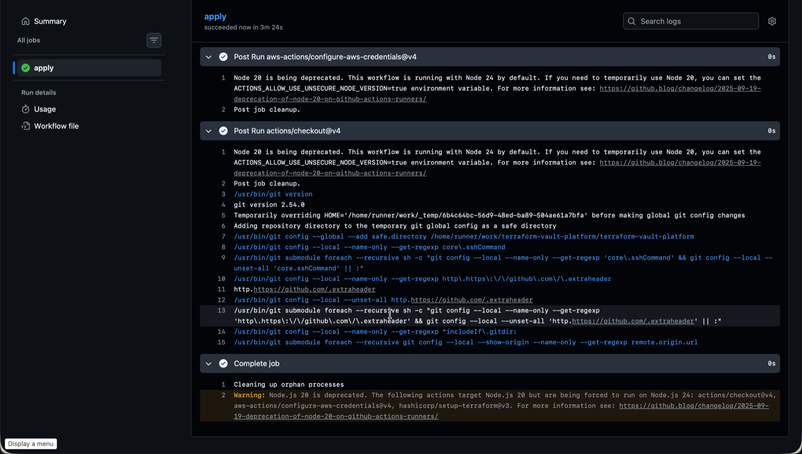
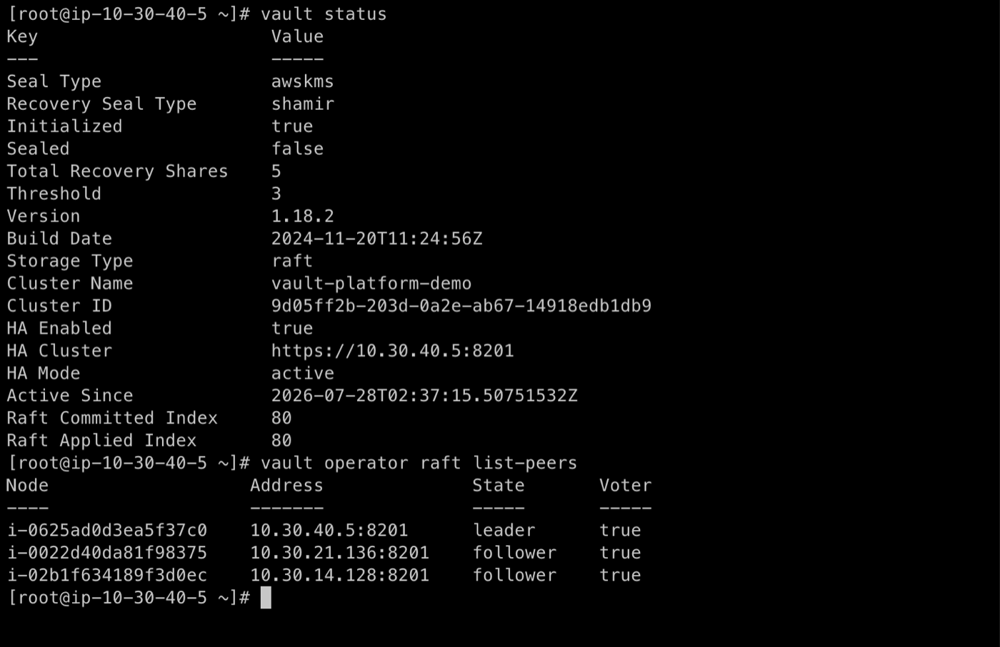
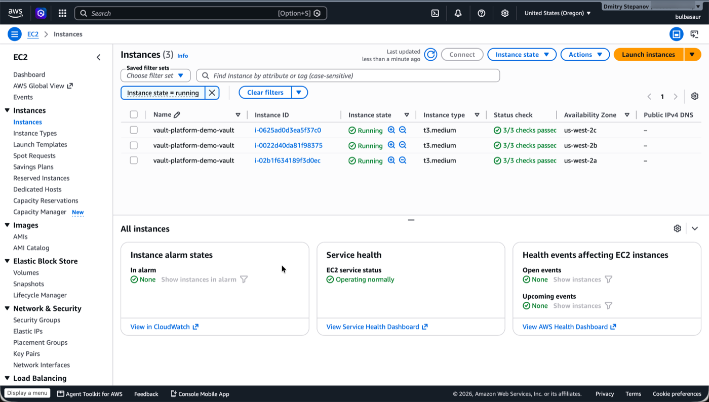
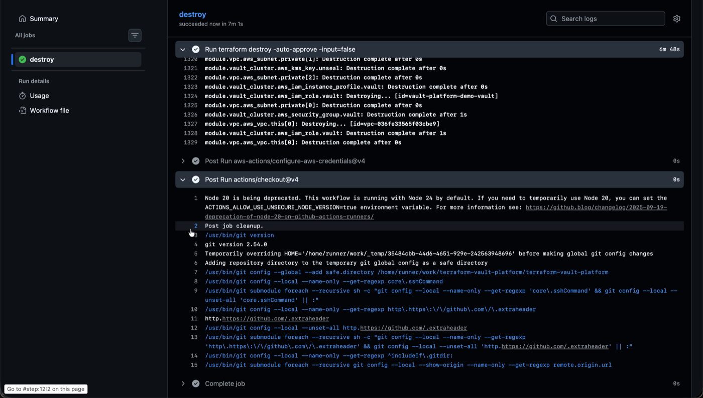

# terraform-vault-platform

Portfolio project: HA HashiCorp Vault cluster on AWS EC2 with Raft
integrated storage and KMS auto-unseal. Provisioned by Terraform, run
by GitHub Actions with OIDC. Same apply-demo-destroy-same-day pattern
as [terraform-eks-platform](https://github.com/bibigon14/terraform-eks-platform).

## Architecture

## What v1 does

- Three-node Vault OSS cluster on EC2 (t3.medium), one per AZ
- Raft integrated storage, no external DB
- KMS auto-unseal: instances start sealed, come up unsealed within
  ~20 seconds via `awskms` seal type
- Auto-join via EC2 tag discovery (`vault-cluster=<name>`) - no
  hardcoded IPs, ASG replacements rejoin automatically
- Internal NLB with tuned health check (tolerates uninitialized and
  sealed states to avoid the ASG killing nodes before first
  `vault operator init`)
- GitHub Actions with OIDC: plan on PR, apply on merge with manual
  approval on `production` environment, destroy manual with `destroy`
  confirmation input
- Sanitized backend config: state bucket, lock table, and role ARN
  come from GitHub repo variables, not the repo

## Follow-ups (v2 scope, not in this repo)

- Enable TLS at the Vault listener with a self-signed cert
  bootstrapped from the cluster's own PKI after init
- Scope the deploy role down from `AdministratorAccess`
- Second-stage Terraform: PKI root + intermediate CA, database
  secrets engine on RDS Postgres, AWS auth method, policies
- Restrict SG ingress from VPC CIDR to just the NLB + SSM endpoints
- Add `tflint` and `trivy` to the plan workflow
- Pre-commit hooks (`terraform fmt`, `tflint`)

## Getting started

See [docs/bootstrap.md](docs/bootstrap.md) for one-time AWS + GitHub
setup and the full apply/init/destroy walkthrough.

## Walkthrough

The plan workflow comments the full plan on every PR. Merging to
main triggers apply, gated by the `production` environment.

### 1. Environment gate

Apply is blocked until manually approved.

### 2. Apply in progress

VPC + NAT come up first (slowest), then Vault ASG, then NLB.

### 3. Apply succeeded

Full stack in ~3-4 minutes on a warm run (5-6 minutes cold).

### 4. Cluster verified

After `vault operator init` (see bootstrap.md for the exact steps
that avoid interactive SSM), the cluster reports HA active, three
Raft peers, one leader.

### 5. Three-AZ topology

ASG places one instance per availability zone.

### 6. Destroy

`terraform destroy` cleans everything except the KMS key, which goes
into the 7-day pending-deletion window.

